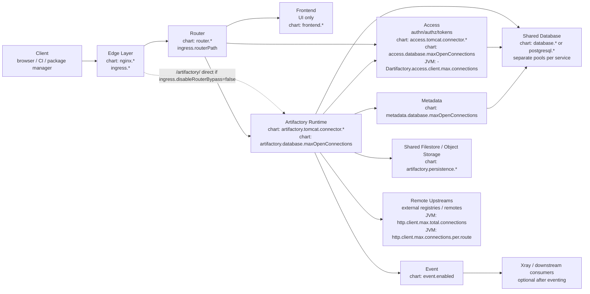
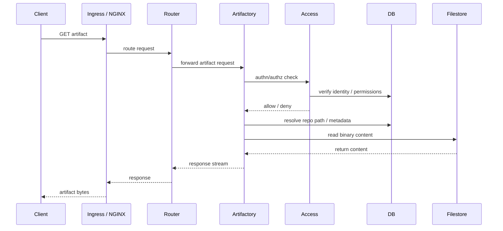
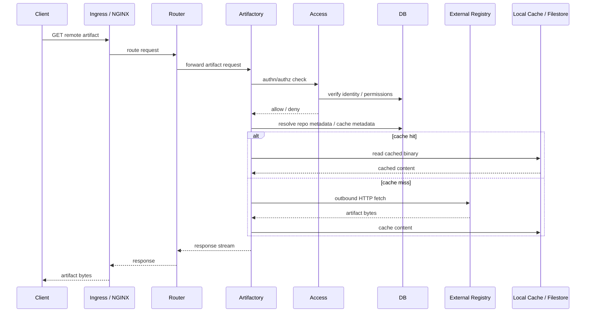
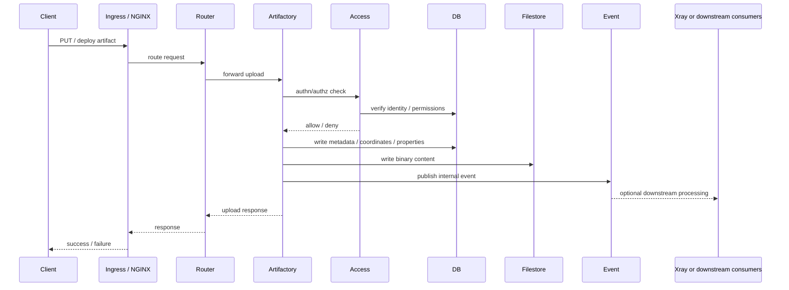

# Artifactory Request Flow Diagram

This note is a request-path mental model for the `artifactoy-ha` chart.

It is meant to answer two questions:

- which Artifactory platform components participate in a request
- which chart settings shape the capacity of each step

## Read This First

Two chart defaults matter for how you read the diagrams:

- `splitServicesToContainers: true` by default in [artifactoy-ha/values.yaml](/Users/lilstew/Downloads/research/artifactoy-ha/values.yaml#L1831)
- `nginx.enabled: true` by default in [artifactoy-ha/values.yaml](/Users/lilstew/Downloads/research/artifactoy-ha/values.yaml#L1527)

Operational meaning:

- Router, Frontend, Metadata, Event, Observability, and Access are modeled as separate platform components
- in this chart, with `splitServicesToContainers: true`, they run as separate containers in the same Artifactory pod or statefulset, not as fully separate deployments
- the main Artifactory container then disables those embedded subservices via env vars in the statefulset templates:
  - [artifactoy-ha/templates/artifactory-primary-statefulset.yaml](/Users/lilstew/Downloads/research/artifactoy-ha/templates/artifactory-primary-statefulset.yaml#L1202)
  - [artifactoy-ha/templates/artifactory-node-statefulset.yaml](/Users/lilstew/Downloads/research/artifactoy-ha/templates/artifactory-node-statefulset.yaml#L1101)

One more routing detail:

- the chart service exposes both `http-router` and `http-artifactory` in [artifactoy-ha/templates/artifactory-service.yaml](/Users/lilstew/Downloads/research/artifactoy-ha/templates/artifactory-service.yaml#L34)
- ingress routes `/` to router and can route `/artifactory/` directly to Artifactory unless `ingress.disableRouterBypass=true` in [artifactoy-ha/templates/ingress.yaml](/Users/lilstew/Downloads/research/artifactoy-ha/templates/ingress.yaml#L52)
- the related port values are:
  - `artifactory.externalPort` / `artifactory.internalPort` for router-facing traffic
  - `artifactory.externalArtifactoryPort` / `artifactory.internalArtifactoryPort` for direct Artifactory traffic
  - reference: [artifactoy-ha/values.yaml](/Users/lilstew/Downloads/research/artifactoy-ha/values.yaml#L682)

## Component Map



## What Each Component Means In A Request

### Router

Router is the platform traffic broker. In the chart, it is configured under:

- [artifactoy-ha/values.yaml](/Users/lilstew/Downloads/research/artifactoy-ha/values.yaml#L252)
- [artifactoy-ha/files/system.yaml](/Users/lilstew/Downloads/research/artifactoy-ha/files/system.yaml#L1)

Think of it as:

- the first platform-aware hop after ingress or nginx
- the thing that forwards traffic to Artifactory, Frontend, Access, and other internal services

### Frontend

Frontend is mainly a UI layer:

- [artifactoy-ha/values.yaml](/Users/lilstew/Downloads/research/artifactoy-ha/values.yaml#L1036)
- [artifactoy-ha/files/system.yaml](/Users/lilstew/Downloads/research/artifactoy-ha/files/system.yaml#L79)

Treat it as:

- important for browser interactions
- usually not the main throughput bottleneck for artifact transfers
- a reflector of slower downstream services

### Artifactory Runtime

This is the main execution engine for repository operations.

Its key request-capacity settings are:

- `artifactory.tomcat.connector.maxThreads`
- `artifactory.tomcat.connector.extraConfig`
- `artifactory.database.maxOpenConnections`
- `artifactory.primary.javaOpts.other`

References:

- [artifactoy-ha/files/system.yaml](/Users/lilstew/Downloads/research/artifactoy-ha/files/system.yaml#L60)
- [artifactoy-ha/values.yaml](/Users/lilstew/Downloads/research/artifactoy-ha/values.yaml#L365)
- [artifactoy-ha/values.yaml](/Users/lilstew/Downloads/research/artifactoy-ha/values.yaml#L370)

This is where one active request usually holds one request-handling thread while it is progressing or waiting.

### Access

Access handles:

- authentication
- authorization
- tokens
- service-to-service trust

Key settings:

- `access.tomcat.connector.maxThreads`
- `access.database.maxOpenConnections`
- `-Dartifactory.access.client.max.connections`

References:

- [artifactoy-ha/files/system.yaml](/Users/lilstew/Downloads/research/artifactoy-ha/files/system.yaml#L82)
- [artifactoy-ha/files/system.yaml](/Users/lilstew/Downloads/research/artifactoy-ha/files/system.yaml#L15)
- [artifactoy-ha/values.yaml](/Users/lilstew/Downloads/research/artifactoy-ha/values.yaml#L1091)

Important nuance:

- Artifactory does not use an MBean to talk to Access
- it uses a real client path to Access
- the MBeans only expose observability for those resources
- if `access.runOnArtifactoryTomcat=true`, the logical Access step still exists, but it is no longer a separate container in the pod

### Metadata

Metadata is a separate platform component in this chart:

- [artifactoy-ha/values.yaml](/Users/lilstew/Downloads/research/artifactoy-ha/values.yaml#L1229)
- [artifactoy-ha/files/system.yaml](/Users/lilstew/Downloads/research/artifactoy-ha/files/system.yaml#L123)

Think of it as:

- a metadata-related service layer
- another consumer of shared DB capacity

### Database

The database is shared, but the pools are not one single knob.

The chart models separate pool limits for:

- Artifactory: `artifactory.database.maxOpenConnections`
- Access: `access.database.maxOpenConnections`
- Metadata: `metadata.database.maxOpenConnections`

References:

- [artifactoy-ha/files/system.yaml](/Users/lilstew/Downloads/research/artifactoy-ha/files/system.yaml#L48)
- [artifactoy-ha/files/system.yaml](/Users/lilstew/Downloads/research/artifactoy-ha/files/system.yaml#L70)
- [artifactoy-ha/files/system.yaml](/Users/lilstew/Downloads/research/artifactoy-ha/files/system.yaml#L84)
- [artifactoy-ha/files/system.yaml](/Users/lilstew/Downloads/research/artifactoy-ha/files/system.yaml#L123)

Functional meaning:

- one request may touch the DB more than once
- but it does not necessarily hold a DB connection during its whole lifetime

### Filestore

This is where the binary content lives.

Key settings are under:

- `artifactory.persistence.type`
- `artifactory.persistence.fileSystem.*`
- `artifactory.persistence.googleStorage.*`
- `artifactory.persistence.awsS3V3.*`
- `artifactory.persistence.azureBlob.*`

Reference:

- [artifactoy-ha/values.yaml](/Users/lilstew/Downloads/research/artifactoy-ha/values.yaml#L770)

Think of it as:

- the content store for local downloads and uploads
- local disk plus shared/object storage depending on the backend type

### Remote Upstreams

This part matters only for remote repositories and cache misses.

The main knobs are JVM parameters, usually injected through `artifactory.primary.javaOpts.other`, for example in sizing overlays:

- `-Dartifactory.http.client.max.total.connections`
- `-Dartifactory.http.client.max.connections.per.route`

Reference:

- [artifactoy-ha/sizing/artifactory-2xlarge-extra-config.yaml](/Users/lilstew/Downloads/research/artifactoy-ha/sizing/artifactory-2xlarge-extra-config.yaml#L13)

Functional meaning:

- `max.total.connections` caps aggregate outbound concurrency
- `max.connections.per.route` caps concurrency toward the same upstream host or route

## Request Path 1: Local Download

This is the common case for a download served from local storage or from already-cached content.



Settings that shape this path most:

- `artifactory.tomcat.connector.maxThreads`
- `artifactory.database.maxOpenConnections`
- `access.tomcat.connector.maxThreads`
- `access.database.maxOpenConnections`
- `metadata.database.maxOpenConnections`
- `artifactory.persistence.*`

Operational reading:

- if storage is slow, request threads stay occupied longer
- if Access is slow, every protected request feels slower
- if DB is slow, metadata resolution and permissions can delay the content read

## Request Path 2: Remote Download

This is the case where Artifactory must go outbound to an upstream remote.



Settings that shape this path most:

- `artifactory.tomcat.connector.maxThreads`
- `artifactory.database.maxOpenConnections`
- `access.tomcat.connector.maxThreads`
- `-Dartifactory.http.client.max.total.connections`
- `-Dartifactory.http.client.max.connections.per.route`
- `artifactory.persistence.*`

Operational reading:

- this is the path where high `maxThreads` can be misleading
- if outbound remote wait dominates, more request threads may only mean more blocked requests

## Request Path 3: Upload

This is the case where the client pushes new content into Artifactory.



Settings that shape this path most:

- `artifactory.tomcat.connector.maxThreads`
- `artifactory.database.maxOpenConnections`
- `access.tomcat.connector.maxThreads`
- `access.database.maxOpenConnections`
- `artifactory.persistence.*`
- `event.enabled`

Operational reading:

- successful upload does not require Xray to finish scanning first
- Xray usually becomes relevant after the upload is already committed and an event has been emitted

## One Request Does Not Hold Everything At Once

This is the most important mental model correction.

A request thread may touch:

- Access
- DB
- filestore
- remote HTTP

but usually not all at the same instant and not for the same duration.

A better model is:

```text
request lifetime = CPU work + DB wait + Access wait + storage wait + remote wait
```

That is why there is no fixed rule like:

```text
Tomcat threads = DB pool = Access pool = outbound HTTP pool
```

The real rule is:

- if one wait component grows, request lifetime grows
- if request lifetime grows, thread occupancy grows
- if thread occupancy grows, pressure rises on the next shared resource

## How To Read The Chart Settings Together

Use this as a quick map:

| Component | Primary chart settings | What they functionally control |
| --- | --- | --- |
| Edge | `nginx.*`, `ingress.*` | entrypoint, external routing, optional router bypass |
| Router | `router.*` | request routing to internal platform services |
| Artifactory runtime | `artifactory.tomcat.connector.*` | active request handling concurrency |
| Artifactory DB work | `artifactory.database.maxOpenConnections` | Artifactory metadata/state DB progress |
| Access | `access.tomcat.connector.*`, `access.database.maxOpenConnections` | authn/authz service progress |
| Artifactory to Access client | `-Dartifactory.access.client.max.connections` | how many concurrent calls Artifactory can drive toward Access |
| Metadata | `metadata.database.maxOpenConnections` | metadata-service DB progress |
| Filestore | `artifactory.persistence.*` | local/shared/object storage behavior |
| Remote repo path | `-Dartifactory.http.client.max.total.connections`, `-Dartifactory.http.client.max.connections.per.route` | outbound remote fetch capacity |
| UI layer | `frontend.*` | frontend behavior, not the primary artifact throughput engine |

## Related Notes

- [artifactory-jvm-parameters-guide.md](/Users/lilstew/Downloads/research/docs/artifactory-jvm-parameters-guide.md)
- [high-level-artifactory-capacity-interdependencies.md](/Users/lilstew/Downloads/research/docs/high-level-artifactory-capacity-interdependencies.md)
- [outbound-http-pool-tuning-for-remote-repositories.md](/Users/lilstew/Downloads/research/docs/outbound-http-pool-tuning-for-remote-repositories.md)
